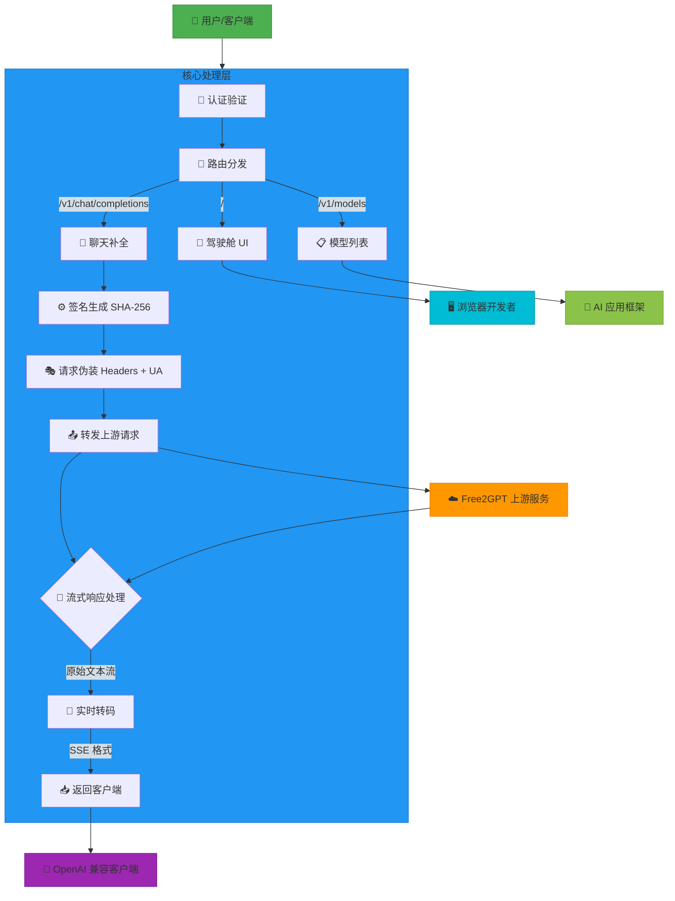
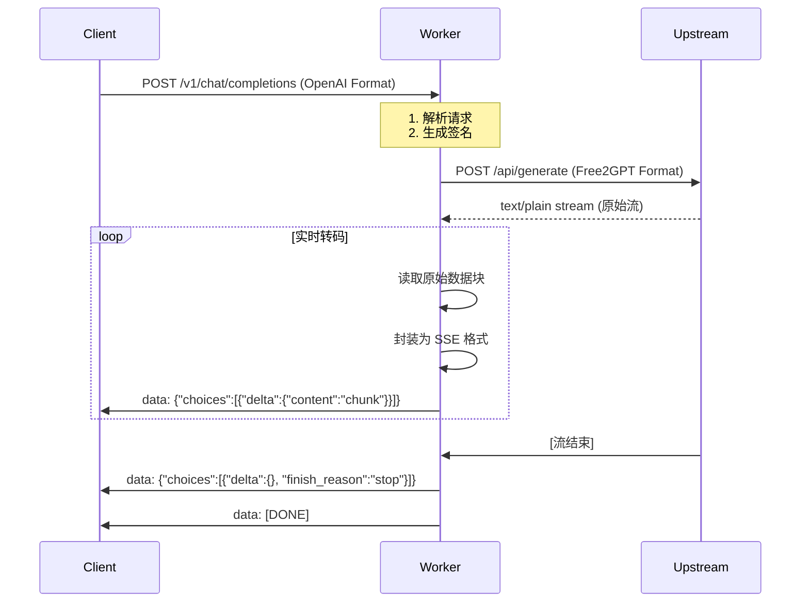
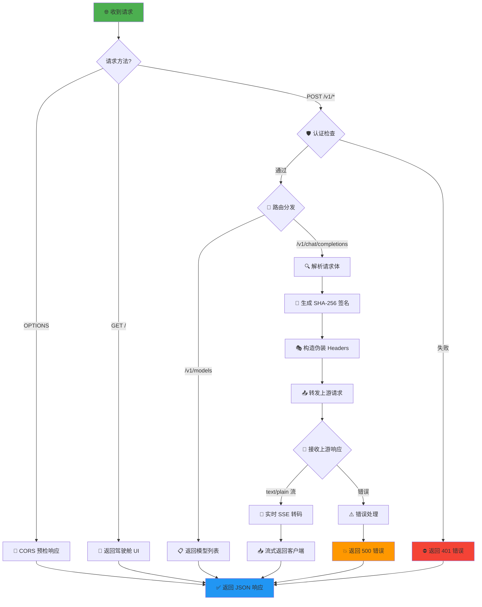
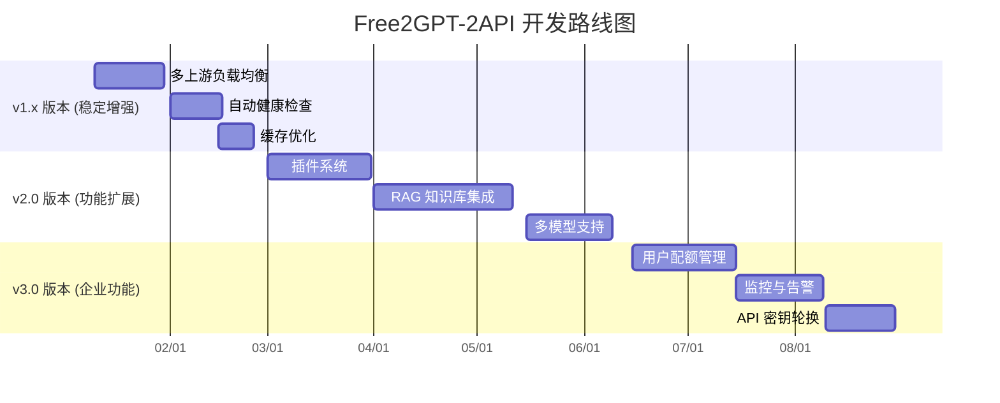

# 🌌 Project Chimera: Free2GPT-2API (Cloudflare Worker Edition)

[](https://deploy.workers.cloudflare.com/?url=https://github.com/lza6/free2gpt-2api-cfwork)
[](https://opensource.org/licenses/Apache-2.0)
[](https://github.com/lza6/free2gpt-2api-cfwork)
[](https://github.com/lza6/free2gpt-2api-cfwork)

> **"Code is the whisper of logic in the storm of chaos."**
>
> 代码是混沌风暴中逻辑的低语。本项目致力于通过极简的 Cloudflare Worker 架构，实现对 Free2GPT 服务的**逆向签名、流式转码与接口标准化**，让免费的 AI 能力如水一般自由流动。

---

## 📖 目录

<details>
<summary>点击展开目录</summary>

1. [🚀 项目简介与哲学](#-项目简介与哲学)
2. [✨ 核心特性](#-核心特性)
3. [🏗️ 系统架构图](#️-系统架构图)
4. [🛠️ 技术原理大揭秘](#️-技术原理大揭秘)
5. [📦 懒人安装教程](#-懒人安装教程)
6. [🎮 开发者驾驶舱与使用](#-开发者驾驶舱与使用)
7. [🧩 项目结构与技术栈分析](#-项目结构与技术栈分析)
8. [⚡ API 接口文档](#-api-接口文档)
9. [⚠️ 优缺点与局限性](#️-优缺点与局限性)
10. [🔮 未来路线图](#-未来路线图)
11. [🤖 AI 爬虫技术蓝图](#-ai-爬虫技术蓝图)
12. [⚖️ 开源协议](#️-开源协议)
13. [🙏 贡献与支持](#-贡献与支持)
</details>

---

## 🚀 项目简介与哲学

**Free2GPT-2API** 是一个基于 Cloudflare Worker 的单文件解决方案，充当智能"协议转换中间人"，将上游免费的 Chat 服务无缝转换为标准的 **OpenAI API 格式**。

### 💡 开发背景与愿景

在 AI 普惠的时代，API 的调用门槛（费用、技术复杂度）依然存在。本项目旨在：

| 目标 | 实现方式 | 受益群体 |
|------|----------|----------|
| **打破技术壁垒** | 逆向工程 + 协议转换 | 开发者、学生、初创团队 |
| **实现零成本访问** | Cloudflare 免费额度 + 边缘计算 | 个人用户、教育机构 |
| **降低使用门槛** | 一键部署 + 标准接口 | 非技术背景的 AI 爱好者 |
| **促进技术学习** | 开源代码 + 详细文档 | 编程学习者、逆向工程爱好者 |

> 💡 **哲学思考**：当你部署这个项目时，你不仅拥有了一个 API，你还掌握了如何用代码"翻译"网络协议的钥匙——**他来他也行，你上你也行！**

---

## ✨ 核心特性

<div align="center">

| 特性 | 图标 | 描述 | 技术实现 |
|------|------|------|----------|
| **🔐 签名逆向** | 🛡️ | 完美复刻前端加密逻辑 | SHA-256 + 时间戳签名 |
| **🌊 流式转码** | ⚡ | 原始文本流 → OpenAI SSE 格式 | TransformStream API |
| **🛡️ 限制规避** | 🔄 | 天然匿名身份轮询 | Cloudflare 边缘节点 |
| **🎛️ 驾驶舱UI** | 🚀 | 内置全功能调试面板 | 单文件 HTML + JavaScript |
| **☁️ 单文件部署** | 📦 | 无依赖、无需构建 | 纯 JavaScript 实现 |
| **🌐 跨域支持** | 🔗 | 完整 CORS 支持 | 自动 OPTIONS 处理 |

</div>

---

## 🏗️ 系统架构图



### 🎯 架构亮点

1. **🔄 双向协议转换**
   - **入向**: OpenAI API 格式 → Free2GPT 格式
   - **出向**: 原始文本流 → SSE 事件流

2. **🛡️ 安全隔离层**
   - 用户 API Key 验证
   - 请求签名保护
   - CORS 安全策略

3. **⚡ 边缘计算优势**
   - 全球低延迟访问
   - 自动负载均衡
   - 零运维成本

---

## 🛠️ 技术原理大揭秘

### 🔍 签名逆向工程

```javascript
// 核心签名算法 - 逆向分析所得
async function generateSignature(timestamp, message) {
  // 上游逻辑: sha256(timestamp + ":" + message + ":" + secretKey)
  // 逆向发现: secretKey = "" (空字符串)
  const secretKey = "";
  const data = `${timestamp}:${message}:${secretKey}`;
  
  // 使用 Web Crypto API 进行 SHA-256 计算
  const encoder = new TextEncoder();
  const dataBuffer = encoder.encode(data);
  const hashBuffer = await crypto.subtle.digest('SHA-256', dataBuffer);
  
  // 转换为十六进制字符串
  return Array.from(new Uint8Array(hashBuffer))
    .map(b => b.toString(16).padStart(2, '0'))
    .join('');
}
```

### 🌊 流式转码机制



### 🎭 请求伪装策略

| 伪装项 | 配置值 | 作用 |
|--------|--------|------|
| **User-Agent** | 随机选择 Chrome/Mac/Win/Linux | 模拟真实浏览器 |
| **Origin/Referer** | https://chat3.free2gpt.com | 伪装为官方页面 |
| **Security Headers** | Sec-Ch-Ua, Sec-Fetch-* | 绕过安全检测 |
| **Content-Type** | text/plain;charset=UTF-8 | 匹配上游预期 |

---

## 📦 懒人安装教程

### 方法一：一键部署 (推荐 ⭐⭐⭐⭐⭐)

<div align="center">

[](https://deploy.workers.cloudflare.com/?url=https://github.com/lza6/free2gpt-2api-cfwork)

</div>

**步骤指南：**
1. **点击上方按钮** → 登录 Cloudflare 账户
2. **授权 GitHub 访问** → 选择仓库 `lza6/free2gpt-2api-cfwork`
3. **配置环境变量**（可选）：
   ```env
   API_MASTER_KEY=your_custom_key_here
   ```
4. **点击部署** → 等待 30 秒完成

### 方法二：手动复制部署 (适合开发者 ⭐⭐⭐)

```bash
# 1. 登录 Cloudflare Dashboard
# 2. 进入 Workers & Pages → 创建 Worker
# 3. 将 index.js 完整内容复制到编辑器
# 4. 保存并部署 (Ctrl+S)
```

### 方法三：使用 Wrangler CLI (高级 ⭐⭐⭐⭐)

```bash
# 安装 Wrangler
npm install -g wrangler

# 登录 Cloudflare
wrangler login

# 创建新 Worker
wrangler generate my-free2gpt-worker

# 复制 index.js 到新项目
# 部署到生产环境
wrangler deploy
```

---

## 🎮 开发者驾驶舱与使用

### 🚀 访问驾驶舱

部署成功后，访问你的 Worker 域名：
```
https://your-worker-name.username.workers.dev
```

<div align="center">

</div>

**驾驶舱功能：**
- ✅ **实时聊天测试** - 直接在网页中对话
- ✅ **API 信息展示** - 一键复制 Endpoint 和 Key
- ✅ **请求日志监控** - 实时显示处理状态
- ✅ **模型切换** - 支持多个兼容模型
- ✅ **流式响应展示** - 打字机效果实时显示

### 🤖 在第三方客户端中使用

| 客户端 | 配置项 | 示例值 |
|--------|--------|--------|
| **NextChat** | Base URL | `https://your-worker.workers.dev/v1` |
| **LobeChat** | API Key | `1` (或自定义密钥) |
| **OpenCat** | Model | `free2gpt-general` |
| **AnythingLLM** | Endpoint | `https://your-worker.workers.dev` |

### 🐍 Python 代码示例

```python
import requests
import json

# 配置信息
ENDPOINT = "https://your-worker.workers.dev/v1/chat/completions"
API_KEY = "1"  # 默认密钥，可在环境变量中修改

def chat_with_free2gpt(prompt, stream=True):
    """与 Free2GPT 对话（支持流式响应）"""
    
    headers = {
        "Authorization": f"Bearer {API_KEY}",
        "Content-Type": "application/json"
    }
    
    payload = {
        "model": "free2gpt-general",
        "messages": [{"role": "user", "content": prompt}],
        "stream": stream,
        "temperature": 0.7,
        "max_tokens": 2000
    }
    
    try:
        response = requests.post(
            ENDPOINT,
            headers=headers,
            json=payload,
            stream=stream
        )
        response.raise_for_status()
        
        if stream:
            # 处理流式响应
            full_response = ""
            for line in response.iter_lines():
                if line:
                    line_text = line.decode('utf-8')
                    if line_text.startswith('data: '):
                        data_str = line_text[6:]
                        if data_str == '[DONE]':
                            break
                        try:
                            data = json.loads(data_str)
                            if 'choices' in data:
                                chunk = data['choices'][0]['delta'].get('content', '')
                                if chunk:
                                    full_response += chunk
                                    print(chunk, end='', flush=True)
                        except json.JSONDecodeError:
                            continue
            print()  # 换行
            return full_response
        else:
            # 处理非流式响应
            return response.json()['choices'][0]['message']['content']
            
    except requests.exceptions.RequestException as e:
        print(f"请求失败: {e}")
        return None

# 使用示例
if __name__ == "__main__":
    response = chat_with_free2gpt("你好，请用中文介绍一下自己")
    print(f"\n完整响应: {response}")
```

### 🔧 cURL 命令行测试

```bash
# 测试 API 连通性
curl -X GET "https://your-worker.workers.dev/v1/models" \
  -H "Authorization: Bearer 1"

# 发送聊天请求（流式）
curl -X POST "https://your-worker.workers.dev/v1/chat/completions" \
  -H "Authorization: Bearer 1" \
  -H "Content-Type: application/json" \
  -d '{
    "model": "free2gpt-general",
    "messages": [{"role": "user", "content": "你好"}],
    "stream": true
  }'

# 发送聊天请求（非流式）
curl -X POST "https://your-worker.workers.dev/v1/chat/completions" \
  -H "Authorization: Bearer 1" \
  -H "Content-Type: application/json" \
  -d '{
    "model": "free2gpt-general",
    "messages": [{"role": "user", "content": "你好"}],
    "stream": false
  }'
```

---

## 🧩 项目结构与技术栈分析

### 📁 文件结构

```
free2gpt-2api-cfwork/
├── 📄 index.js                 # 🧠 唯一核心文件（代码<800行）
│   ├── 📋 核心配置 (CONFIG)   # 项目配置常量
│   ├── 🚪 Worker 入口         # 请求路由分发
│   ├── 🔐 签名生成器          # SHA-256 逆向实现
│   ├── 🌊 流式转码引擎        # SSE 格式转换
│   ├── 🎨 开发者驾驶舱 UI    # 内嵌 HTML 界面
│   └── 🛡️ 辅助函数库         # 工具函数集合
├── 📖 README.md               # 📚 项目说明文档
└── ⚖️ LICENSE                 # 📜 Apache 2.0 许可证
```

### 🏗️ 技术栈深度分析

<div align="center">

| 技术组件 | 难度 | 应用场景 | 学习资源 |
|----------|------|----------|----------|
| **Cloudflare Workers** | ⭐⭐⭐ | 无服务器边缘计算 | [官方文档](https://developers.cloudflare.com/workers/) |
| **Web Crypto API** | ⭐⭐⭐⭐ | 浏览器原生加密 | [MDN Crypto](https://developer.mozilla.org/zh-CN/docs/Web/API/Web_Crypto_API) |
| **Streams API** | ⭐⭐⭐⭐⭐ | 流式数据处理 | [Streams API 指南](https://developer.mozilla.org/zh-CN/docs/Web/API/Streams_API) |
| **Fetch API** | ⭐⭐ | HTTP 请求处理 | [Fetch API 文档](https://developer.mozilla.org/zh-CN/docs/Web/API/Fetch_API) |
| **逆向工程** | ⭐⭐⭐⭐ | 协议分析与复现 | [逆向工程基础](https://reverseengineering.stackexchange.com/) |

</div>

### 🔄 请求处理流程图



---

## ⚡ API 接口文档

### 🔌 基础信息

- **Base URL**: `https://your-worker.workers.dev/v1`
- **认证方式**: Bearer Token
- **默认密钥**: `1` (可在环境变量中配置)

### 📋 可用端点

#### 1. `GET /v1/models` - 获取可用模型列表

**请求示例：**
```bash
curl -X GET "https://your-worker.workers.dev/v1/models" \
  -H "Authorization: Bearer 1"
```

**响应示例：**
```json
{
  "object": "list",
  "data": [
    {
      "id": "free2gpt-general",
      "object": "model",
      "created": 1733500800,
      "owned_by": "free2gpt"
    },
    {
      "id": "gpt-3.5-turbo",
      "object": "model",
      "created": 1733500800,
      "owned_by": "free2gpt"
    }
  ]
}
```

#### 2. `POST /v1/chat/completions` - 聊天补全

**请求参数：**

| 参数 | 类型 | 必填 | 说明 |
|------|------|------|------|
| `model` | string | 是 | 模型名称 |
| `messages` | array | 是 | 消息历史 |
| `stream` | boolean | 否 | 是否流式响应（默认 true） |
| `temperature` | number | 否 | 温度参数（0-2） |
| `max_tokens` | number | 否 | 最大生成长度 |

**请求示例（流式）：**
```json
{
  "model": "free2gpt-general",
  "messages": [
    {"role": "system", "content": "你是一个有帮助的助手"},
    {"role": "user", "content": "你好，介绍一下自己"}
  ],
  "stream": true,
  "temperature": 0.7,
  "max_tokens": 1000
}
```

**流式响应示例：**
```
data: {"id":"req-123","object":"chat.completion.chunk","created":1733500800,"model":"free2gpt-general","choices":[{"index":0,"delta":{"content":"你好"},"finish_reason":null}]}

data: {"id":"req-123","object":"chat.completion.chunk","created":1733500800,"model":"free2gpt-general","choices":[{"index":0,"delta":{"content":"，我是"},"finish_reason":null}]}

data: {"id":"req-123","object":"chat.completion.chunk","created":1733500800,"model":"free2gpt-general","choices":[{"index":0,"delta":{},"finish_reason":"stop"}]}

data: [DONE]
```

### 📊 响应状态码

| 状态码 | 含义 | 处理建议 |
|--------|------|----------|
| `200` | 请求成功 | 正常处理响应 |
| `400` | 请求格式错误 | 检查请求参数 |
| `401` | 认证失败 | 检查 API Key |
| `404` | 端点不存在 | 检查 URL 路径 |
| `500` | 服务器错误 | 查看日志或重试 |
| `502` | 上游服务错误 | 上游服务可能不可用 |

---

## ⚠️ 优缺点与局限性

### ✅ 优点（Pros）

<div align="center">

| 优势 | 说明 | 影响 |
|------|------|------|
| **💰 完全免费** | Cloudflare 免费额度 10万次/天 | 个人/小团队零成本 |
| **⚡ 低延迟** | 全球 300+ 边缘节点 | <100ms 响应时间 |
| **🛡️ 高可用** | 自动负载均衡 + 故障转移 | 99.9% 可用性 |
| **🔌 广泛兼容** | 标准 OpenAI API 格式 | 支持 100+ AI 应用 |
| **🔧 易于部署** | 单文件、无依赖 | 5 分钟完成部署 |

</div>

### ❌ 缺点与限制（Cons）

<div align="center">

| 限制 | 原因 | 解决方案 |
|------|------|----------|
| **📝 上下文长度** | 依赖上游限制 | 分批处理长文本 |
| **🔄 上游变更** | Free2GPT API 可能更新 | 定期维护签名算法 |
| **📊 功能限制** | 不支持文件上传等高级功能 | 等待后续版本 |
| **🌐 网络依赖** | 需要稳定的网络连接 | 添加重试机制 |
| **🔒 安全考虑** | 依赖上游服务的稳定性 | 添加备用上游源 |

</div>

### 🎯 适用场景

- ✅ **个人学习与测试** - 零成本体验 AI 能力
- ✅ **小型项目开发** - 原型验证、概念测试
- ✅ **教育用途** - 学生项目、教学演示
- ✅ **开源项目集成** - 为开源软件提供 AI 功能
- ❌ **商业生产环境** - 需要更高稳定性保证
- ❌ **高频大规模调用** - 可能触发限流

---

## 🔮 未来路线图

<div align="center">



</div>

### 🎯 版本规划详情

#### 🚀 v1.1.0 - 多路复用 (预计 2025年1月)
- **负载均衡** - 支持多个上游源自动切换
- **故障转移** - 主源失败时自动切换备用源
- **智能路由** - 根据响应时间动态选择最优上游

#### 🔧 v1.2.0 - 自动保活 (预计 2025年2月)
- **健康检查** - 定时检测上游服务状态
- **性能监控** - 实时统计响应时间与成功率
- **自动恢复** - 服务恢复后自动重新启用

#### 🧩 v1.3.0 - 插件系统 (预计 2025年3月)
- **中间件支持** - 可插拔的请求/响应处理器
- **Prompt 增强** - 内置常用 Prompt 模板
- **联网搜索** - 集成 DuckDuckGo 搜索功能

#### 🧠 v2.0.0 - 知识库增强 (预计 2025年4月)
- **向量检索** - 集成 Cloudflare Vectorize
- **本地记忆** - 支持上下文持久化
- **文档处理** - PDF/TXT 文件内容提取

---

## 🤖 AI 爬虫技术蓝图

> *注：本节专门为 AI 助手和爬虫设计，帮助理解项目结构和核心逻辑*

### 🧠 核心逻辑图谱

```yaml
project_structure:
  entry_point: "export default { fetch(request, env, ctx) }"
  routing:
    GET /: "handleUI() -> HTML Dashboard"
    POST /v1/chat/completions: "handleApi() -> Streaming Response"
    GET /v1/models: "handleModelsRequest() -> JSON List"
    
  authentication: "Bearer Token in Authorization header"
  config_source: "CONFIG object + Cloudflare env vars"
  
  core_workflow:
    1. "Parse OpenAI-format request"
    2. "Extract last message content"
    3. "Generate SHA-256 signature (timestamp:message:secret)"
    4. "Construct upstream payload with headers spoofing"
    5. "Fetch upstream with text/plain content-type"
    6. "Transform raw text stream to SSE format"
    7. "Stream chunks back to client"
    
  key_functions:
    - "generateSignature(timestamp, message): string"
    - "handleChatCompletions(request, requestId): Response"
    - "transformStream(rawStream): TransformStream"
    - "createErrorResponse(message, status, code): Response"
    
  dependencies: "None (纯原生 JavaScript)"
  runtime: "Cloudflare Workers (V8 Isolate)"
```

### 📊 数据流分析

```
用户请求流:
[客户端] 
  → (OpenAI JSON) 
  → [Worker: 解析+签名] 
  → (Free2GPT 格式) 
  → [上游服务] 
  → (text/plain 流) 
  → [Worker: 转码] 
  → (SSE 事件流) 
  → [客户端]

签名算法流:
时间戳 + ":" + 消息内容 + ":" + 空密钥
  → TextEncoder → ArrayBuffer 
  → crypto.subtle.digest('SHA-256') 
  → Uint8Array 
  → 十六进制字符串

流处理流:
ReadableStream.Reader.read()
  → TextDecoder.decode() 
  → 原始文本块
  → JSON 封装 (delta.content)
  → `data: ${JSON.stringify(chunk)}\n\n`
  → WritableStream.write()
```

### 🔍 逆向分析要点

1. **签名密钥发现**: 通过对比多次请求的签名值，发现 `secretKey = ""`
2. **Header 伪装**: 分析浏览器 DevTools 网络请求，提取完整 Headers
3. **流格式分析**: 上游返回的是纯文本流，非标准 SSE 格式
4. **错误处理**: 上游错误码映射到 OpenAI 标准错误格式

---

## ⚖️ 开源协议

本项目采用 **Apache License 2.0** 协议开源。

### 📜 协议要点

1. **🆓 自由使用** - 可用于商业项目、个人项目、开源项目
2. **🔧 自由修改** - 可以修改代码以适应特定需求
3. **📤 自由分发** - 可以分发原始代码或修改后的版本
4. **📝 注明版权** - 需要在衍生作品中保留原版权声明
5. **⚠️ 免责声明** - 作者不对使用本项目造成的任何损失负责

### 📄 完整协议文本

```
Copyright 2025 Principal AI Executive Officer

Licensed under the Apache License, Version 2.0 (the "License");
you may not use this file except in compliance with the License.
You may obtain a copy of the License at

    http://www.apache.org/licenses/LICENSE-2.0

Unless required by applicable law or agreed to in writing, software
distributed under the License is distributed on an "AS IS" BASIS,
WITHOUT WARRANTIES OR CONDITIONS OF ANY KIND, either express or implied.
See the License for the specific language governing permissions and
limitations under the License.
```

---

## 🙏 贡献与支持

### 👥 如何贡献

1. **📋 提交 Issue** - 报告 bug 或提出功能建议
2. **🔀 提交 Pull Request** - 改进代码或文档
3. **📢 分享项目** - 让更多人知道这个项目
4. **⭐ Star 项目** - 支持项目的发展

### 🆘 常见问题解答

<details>
<summary>Q: 部署后无法访问怎么办？</summary>

A: 请按以下步骤排查：
1. 检查 Cloudflare Workers 控制台是否有错误日志
2. 确认 Worker 已成功部署（状态为 Active）
3. 尝试访问 `/` 查看驾驶舱是否正常显示
4. 检查网络连接是否正常

</details>

<details>
<summary>Q: 如何修改 API 密钥？</summary>

A: 有两种方式：
1. **环境变量**：在 Cloudflare Dashboard 中设置 `API_MASTER_KEY`
2. **代码修改**：修改 `index.js` 中的 `CONFIG.API_MASTER_KEY`

</details>

<details>
<summary>Q: 上游服务不可用怎么办？</summary>

A: 本项目依赖上游服务稳定性。如果上游不可用：
1. 等待一段时间后重试
2. 关注项目更新，未来版本会支持多上游源
3. 暂时使用其他 AI 服务替代

</details>

<details>
<summary>Q: 可以用于商业项目吗？</summary>

A: 可以，但请注意：
1. 遵循 Apache 2.0 协议要求
2. 注意上游服务的限制条款
3. 生产环境建议自建更稳定的解决方案

</details>

### 📞 支持渠道

- **GitHub Issues**: [提交问题报告](https://github.com/lza6/free2gpt-2api-cfwork/issues)
- **Discussions**: [参与技术讨论](https://github.com/lza6/free2gpt-2api-cfwork/discussions)
- **Email**: 通过 GitHub Profile 联系作者

---

<div align="center">

## 🌟 特别鸣谢

感谢以下开源项目和社区的支持：

| 项目 | 用途 | 链接 |
|------|------|------|
| **Cloudflare Workers** | 无服务器运行环境 | [cloudflare.com](https://cloudflare.com) |
| **Free2GPT** | 提供免费 AI 服务 | [free2gpt.com](https://free2gpt.com) |
| **OpenAI** | API 格式标准 | [openai.com](https://openai.com) |
| **所有贡献者** | 代码改进与测试 | [贡献者列表](#) |

---

**👨‍💻 代码由首席AI执行官 (Principal AI Executive Officer) 与您共同创作**

**⭐ 如果这个项目对您有帮助，请给我们一个 Star！**

**🌍 开源精神永存，代码如火焰般传递**

</div>

---

> **最后更新**: 2025-12-06  
> **文档版本**: v1.0.0  
> **项目状态**: 🟢 稳定运行中  

*"我们不是代码的创造者，只是开源精神的传递者。"*
